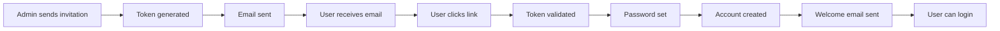

# 🎯 Admin Invitation System - Complete Implementation

## 📋 Overview

The Admin Invitation System provides a secure, professional way to invite new admin users to your Trinexa application. It integrates with the existing email template system, provides secure token-based invitations, and includes a complete user onboarding flow.

## ✨ Features

### 🔐 Security Features
- **Secure Token Generation**: Cryptographically secure invitation tokens
- **Expiry Management**: 7-day default expiry with automatic cleanup
- **Password Hashing**: bcrypt-based secure password storage
- **Database Security**: Proper indexing and constraints
- **XSS Protection**: Safe email template rendering

### 📧 Email System
- **Existing Template Integration**: Works with current email_templates table
- **Variable Substitution**: `{{variable}}` syntax for dynamic content
- **Professional Templates**: Pre-built invitation and welcome emails
- **Template Management**: Full CRUD through admin interface
- **Development Fallback**: Console logging when email service unavailable

### 👥 User Management
- **Role-Based Invitations**: Admin, Super Admin, Moderator roles
- **Invitation Tracking**: Complete status monitoring
- **Integration**: Works alongside existing user management
- **Audit Trail**: Complete invitation history

## 🏗️ Architecture

### Database Schema
```sql
-- Core Tables
admin_invitations     -- Invitation management
email_templates       -- Enhanced existing table (no schema changes)
admin_users          -- Enhanced with password fields

-- Key Functions
generate_invitation_token()    -- Secure token creation
hash_password()               -- Password hashing  
verify_password()            -- Password verification
```

### API Services
```typescript
// Invitation Management
api.adminInvitations.getAll()
api.adminInvitations.create() 
api.adminInvitations.acceptInvitation()
api.adminInvitations.cancelInvitation()
api.adminInvitations.resendInvitation()

// Email Template Management (enhanced existing)
api.invitationEmailTemplates.getAll()
api.invitationEmailTemplates.getByType()
api.invitationEmailTemplates.create()
api.invitationEmailTemplates.update()
```

### React Components
```typescript
<AdminInvitationManager />     // Main invitation interface
<EmailTemplateManager />       // Template configuration
<AcceptInvitationPage />       // User signup flow
```

## 🚀 Quick Start

### 1. Database Setup
```bash
# Apply the migration
npx supabase db reset

# Or run specific migration
npx supabase migration up
```

### 2. Access Admin Panel
1. Navigate to `/admin/settings`
2. Click on "User Management" tab
3. Use "Send Invitation" to invite new admins

### 3. Email Configuration
1. In Settings → User Management
2. Configure email templates
3. Set up your email service endpoint

## 📖 Usage Guide

### Sending Invitations

1. **Go to Admin Settings**
   - Navigate to `/admin/settings`
   - Select "User Management" tab

2. **Send New Invitation**
   - Click "Send Invitation"
   - Enter email and select role
   - System generates secure invitation

3. **Email Sent Automatically**
   - Professional email with invitation link
   - 7-day expiry for security
   - Clear instructions for recipient

### Managing Templates

1. **Access Template Manager**
   - In User Management section
   - Email Templates card

2. **Use Default Templates**
   - Pre-built professional templates
   - Click "Use Default [Type]" buttons
   - Customize as needed

3. **Template Variables**
   ```
   {{company_name}}     - Your company name
   {{email}}           - Recipient email
   {{role}}            - Assigned role
   {{invitation_url}}  - Signup link
   {{expires_at}}      - Expiry date
   {{support_email}}   - Support contact
   {{name}}            - User's name
   {{login_url}}       - Admin login URL
   ```

### User Acceptance Flow

1. **User Receives Email**
   - Professional invitation email
   - Clear call-to-action button
   - Security information

2. **Clicks Invitation Link**
   - Redirected to `/admin/accept-invitation?token=...`
   - Token validated for security

3. **Completes Signup**
   - Sets secure password
   - Optionally provides name
   - Account created automatically

4. **Welcome Email Sent**
   - Confirmation of account creation
   - Login instructions
   - Support information

## 🔧 Configuration

### Email Service Setup

1. **Configure Email Endpoint**
   ```typescript
   // In emailService.ts
   const response = await fetch('/api/send-email', {
     method: 'POST',
     body: JSON.stringify(emailData)
   });
   ```

2. **Environment Variables**
   ```env
   SMTP_HOST=smtp.gmail.com
   SMTP_PORT=587
   SMTP_USER=your-email@domain.com
   SMTP_PASS=your-app-password
   ```

3. **Email Service Config**
   ```typescript
   export const emailService = new EmailService({
     from: 'admin@trinexa.com',
     replyTo: 'support@trinexa.com'
   });
   ```

### Template Customization

1. **HTML Templates**
   - Responsive design included
   - Company branding placeholders
   - Professional styling

2. **Variable System**
   - Secure placeholder replacement
   - XSS protection built-in
   - Flexible content structure

3. **Template Types**
   - `admin_invitation`: New user invites
   - `account_welcome`: Signup confirmation
   - `password_reset`: Password recovery

## 🛡️ Security Features

### Token Security
- **Cryptographic Tokens**: 32-byte random generation
- **Single Use**: Tokens invalidated after use
- **Time-Limited**: 7-day expiry with automatic cleanup
- **Unique Constraints**: Database-level uniqueness

### Password Security
- **bcrypt Hashing**: Industry-standard password hashing
- **Salt Rounds**: Configurable security levels
- **Minimum Requirements**: 8+ character enforcement
- **Verification**: Secure password checking

### Database Security
- **Row Level Security**: User-based access control
- **Input Validation**: SQL injection prevention
- **Audit Logging**: Complete action tracking
- **Permission Controls**: Role-based access

## 🧪 Testing

### Manual Testing
1. **Send Test Invitation**
   ```typescript
   const invitation = await api.adminInvitations.create({
     email: 'test@example.com',
     role: 'admin'
   });
   ```

2. **Check Email Templates**
   ```typescript
   const templates = await api.invitationEmailTemplates.getAll();
   console.log('Available templates:', templates.length);
   ```

3. **Test Template Rendering**
   ```javascript
   // Use test-invitation-system.js
   node test-invitation-system.js
   ```

### Development Mode
```javascript
// Email service logs to console in development
if (process.env.NODE_ENV === 'development') {
  console.log('EMAIL CONTENT:', emailData);
}
```

## 📁 File Structure

```
src/
├── components/admin/
│   ├── AdminInvitationManager.tsx    # Main invitation UI
│   └── EmailTemplateManager.tsx      # Template configuration
├── pages/
│   ├── AcceptInvitationPage.tsx      # User signup flow
│   └── admin/SettingsPage.tsx        # Enhanced with invitations
├── services/
│   ├── api.ts                        # Enhanced API methods
│   └── emailService.ts               # Email sending service
└── App.tsx                           # Updated routing

supabase/migrations/
└── 20250802000001_admin_invitation_system.sql  # Database schema
```

## 🎨 UI Components

### AdminInvitationManager
- Send new invitations
- View invitation status
- Resend/cancel actions
- Real-time updates

### EmailTemplateManager
- Template CRUD operations
- Default template options
- Variable documentation
- Live preview capability

### AcceptInvitationPage
- Token validation
- Password creation
- Error handling
- Success confirmation

## 🔄 Workflow



## 🎯 Future Enhancements

### Planned Features
- [ ] Bulk invitation upload (CSV)
- [ ] Custom expiry periods per invitation
- [ ] Email template preview mode
- [ ] Invitation analytics dashboard
- [ ] Custom domain email integration
- [ ] Advanced role permissions
- [ ] Multi-language templates
- [ ] Email delivery status tracking

### Integration Options
- [ ] Active Directory integration
- [ ] SSO (Single Sign-On) support
- [ ] Slack/Teams notifications
- [ ] Calendar integration for onboarding
- [ ] Advanced audit logging
- [ ] API rate limiting
- [ ] Email provider failover

## 📞 Support

### Common Issues

1. **Migration Errors**
   ```bash
   # Reset database
   npx supabase db reset
   ```

2. **Email Not Sending**
   - Check email service configuration
   - Verify development mode logs
   - Test with emailService.sendTestEmail()

3. **Template Variables Not Working**
   - Use double curly braces: `{{variable}}`
   - Check variable spelling
   - Verify template is active

### Getting Help
- Check console for error messages
- Review database logs
- Test with development mode
- Verify all migrations applied

---

## 🎉 Conclusion

The Admin Invitation System provides a complete, secure, and professional solution for managing admin user onboarding. With configurable email templates, robust security features, and an intuitive interface, it streamlines the process of adding new team members to your admin panel.

**Ready to invite your first admin user? Head to `/admin/settings` and start inviting! 🚀**
